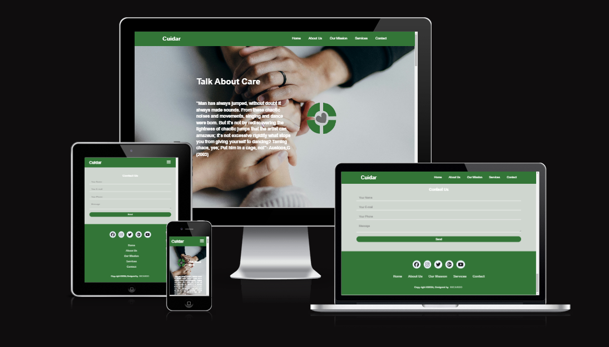
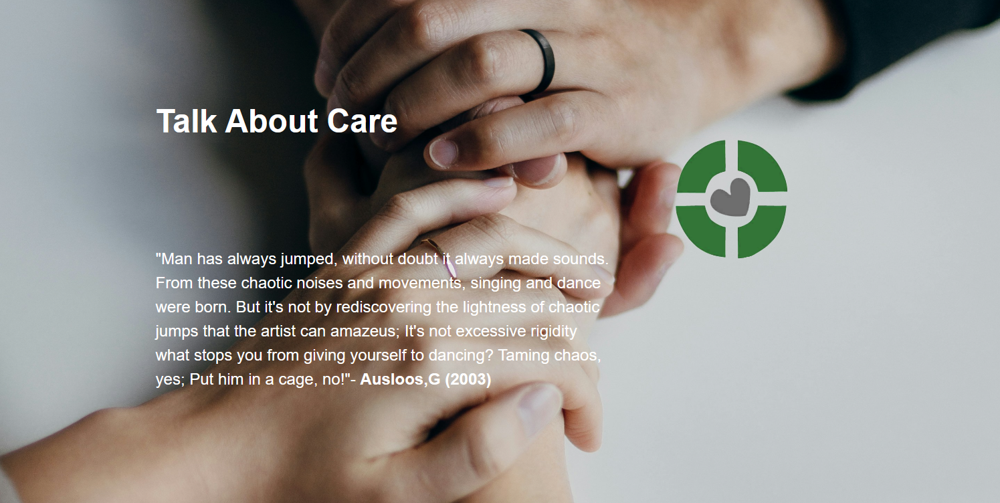
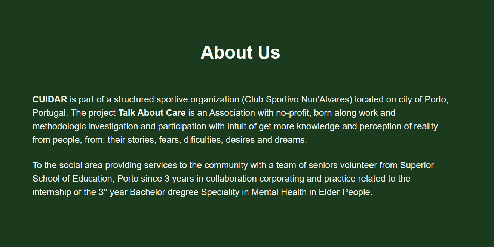
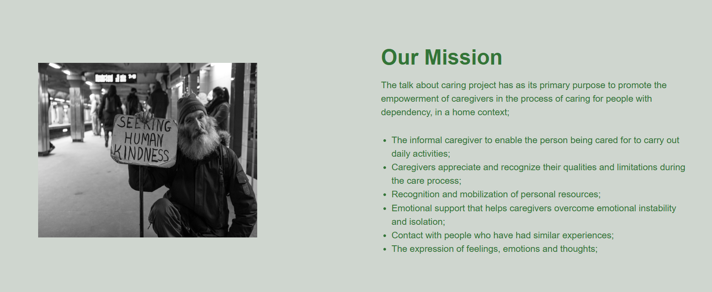
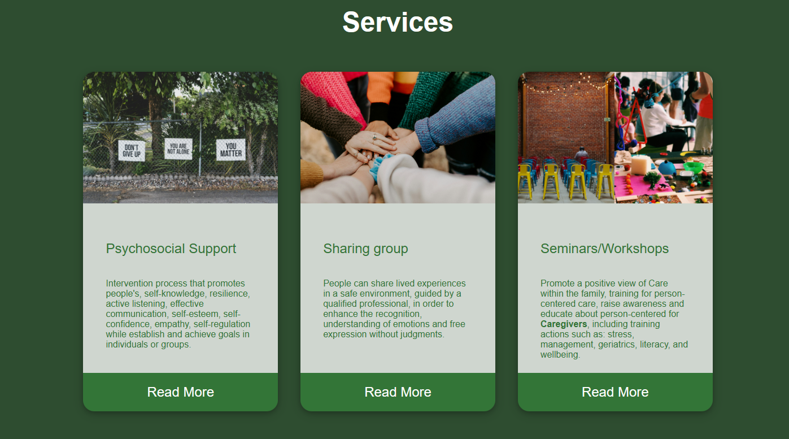
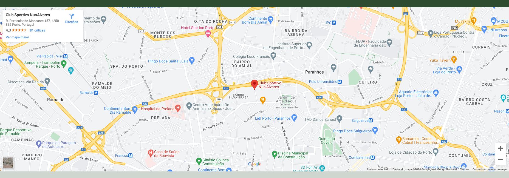
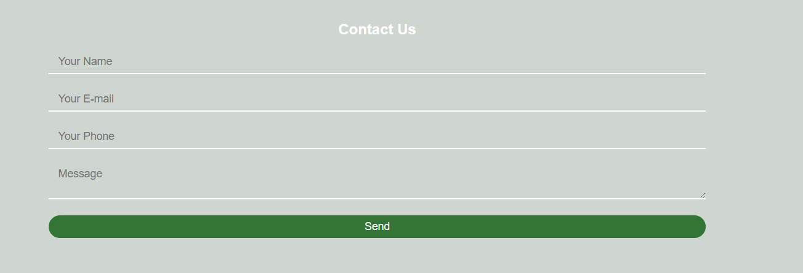
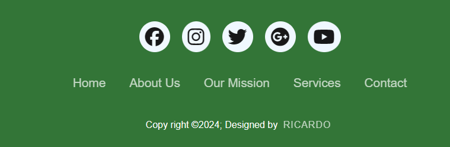
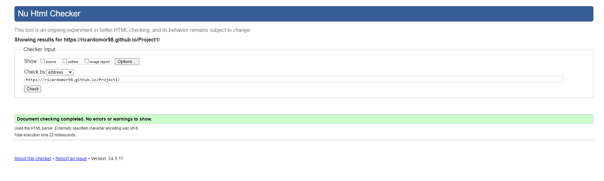
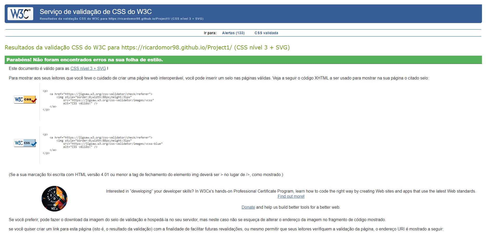

# CUIDAR

   

CUIDAR is website that aims to "Talk About Care". The site is intended to users to know more about caregivers and their missions. 
A site to support the caregivers helping people undersand the meaning of a caregiver and what they do.

The live link can be found here - https://ricardomor98.github.io/Project1/

## Site Goals

- To provide the user to understand what a caregiver is

- To assist and transmit what it means to be a caregiver.

- To enable the user to locate Caregivers support area.

## Nav Bar

- The Navbar was includes a responsive navigation with links to different sections like the Home-page,  About Us-page, Our Mission-page, Service-page, Contact-page. 

- Icons hide when screensize minimize providing easy access to navigate through the website on various devices.

## Home Page

- The Home-page contain a back groung image representing social interaction. Including the Logo from the Association and a quote (by Ausloos,G (2003) ) from the ideology represented.

## About Us Page

- Include a small description about the Association, including the location and the team with their qualifications and Institutions who collaborate in the same social area.

## Our Mission Page

- In this page we clarify to the readers what the mission of the Association are. The image is a representation of social help "Seeking Human Kindness".

## Service Page

- Service Page offers to readers our different programs that we specif use to help people in their different needs and oportunities to share experiences and problems they deal in their lifes.

## Contact Page

- The full-screen map allows the user to have an easier view of the Association location, and allows them to move it in order to see an easier route to the destination.

- The form is simple allow the user to contact the association with a message completing the full data requests: Name, e-mail and phone number to validate the submission.

## Footer Page

- The footer section of the website contains social media icons linking to Facebook, Instagram, Twitter, Google+, YouTube pages.

- Users can easily access the website's social media platforms by clicking on the respective icons.

- The footer also includes designer's name (Ricardo) for attributing credit.

- This footer design provides a professional and polished conclusion to the webpage, enhancing the overall user experience.

## Testing

- Validator Testing 

   - HTML

No errors were returned when passing through the official W3C Markup Validator W3C Validator Results.

   - CSS

No errors were found when passing through the official W3C CSS Validator
W3C CSS Validator Results

## Browser Testing

- The Website was tested on Google Chrome, Firefox, Microsoft Edge, Safari browsers with no issues noted.

## Device Testing

- The website was viewed on a variety of devices such as Desktop, Laptop, iPhone 8, iPhoneX and iPad to ensure responsiveness on various screen sizes. 

- The website performed as intended. 

- The responsive design was also checked using Chrome developer tools across multiple devices with structural integrity holding for the various sizes.

- I also used the following websites to test responsiveness:
     
     - Responsinator

## Future Improvements

- Improvment on the visuality for different devices.

- Add a search functionality for users to quickly find specific information.

- Enhance user interaction with more dynamic features and multimedia elements.

- Social Media links in the footer to ensure they direct the user to the correct page and open in a new tab.

## Deployment

- The project was deployed using GitHub pages. The steps to deploy using GitHub pages are:

   - Go to the repository on GitHub.com

   - Select 'Settings' near the top of the page.
   
   - Select 'Pages' from the menu bar on the left of the page.
   
   - Under 'Source' select the 'Branch' dropdown menu and select the main branch.
   
   - Once selected, click the 'Save'.
   
   - Deployment should be confirmed by a message on a green background saying "Your site is published at" followed by the web address.
   
   - The live link can be found here - https://ricardomor98.github.io/Project1/

## Resources

- Font Awesome icons for navigation menu (https://fontawesome.com/)

- Bootstrap CSS framework for responsive design (https://getbootstrap.com/)

- Google Fonts for custom typography (https://fonts.google.com/)

## Content

- Idea procreated by family context and studies in the area.

## Code snippets

- Functionality inspired by W3Schools (https://www.w3schools.com/)

## Special Thanks

- Thanks to the open-source community for creating resources and tools that made this project possible.

- Special thanks to Mentor-Antonio Rodriguez  for his guidance and support throughout the project.